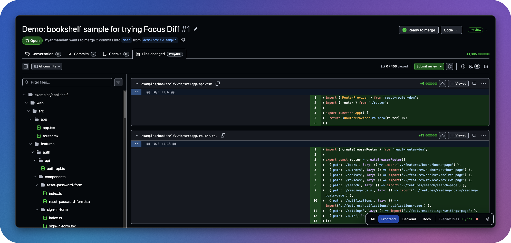

<div align="center">
  
  <h1>Focus Diff</h1>
  <p><strong>Review what matters.</strong><br>Filter GitHub pull request diffs down to the files you need to review.</p>
  <p>
    <a href="https://github.com/hyanmandian/focus-diff/actions/workflows/ci.yml"></a>
    <a href="LICENSE"></a>
    
  </p>
</div>



## Why

Large pull requests mix the code you need to read with tests, stories, generated files and docs. Focus Diff adds a small bar to the **Files changed** page: pick a filter and only the matching files stay on screen. The file tree, the **Files changed** counter and the **+/−** totals follow along, so you see the real size of your review before you start.

## Features

- **Your own filters.** Each filter is a button with an _Include_ regex and an optional _Exclude_ regex, tested against the full file path. **All** is always there.
- **Everywhere or per repository.** Keep filters for every pull request, and add extra ones for `owner/name` or a whole `owner/*`.
- **Real numbers.** Files changed and the line totals show only what the filter keeps, and update as GitHub loads more files.
- **Combine filters.** Turn on as many as you like, like _Frontend + Docs_. Turn them all off and you're back on **All**.
- **See where the changes are.** The breakdown shows, per filter, how many files you've marked as viewed, the lines changed and the time left.
- **Review time left.** An estimate next to the line totals, from about 400 changed lines per hour, that drops as you mark files as viewed.
- **Next unviewed.** Jump to the next file you haven't marked as viewed, even in large pull requests where GitHub hasn't rendered it yet.
- **Conversations.** Step through review threads one by one. Each shows its file and line, and whether it's waiting on you, answered or resolved.
- **Keyboard friendly.** Arrow keys inside the bar, plus global shortcuts.
- **Made to share.** Copy your filters and send them to a teammate, who imports them in one step.
- **Feels like GitHub.** Follows your GitHub theme, checked against WCAG 2.1 AA, respects reduced motion, and speaks English and Portuguese.
- **Private.** No tracking and no network requests. Filters stay in your browser profile. See the [privacy policy](PRIVACY.md).

## Getting started

Focus Diff starts empty, so your filters fit the way you review. Right after installing, a welcome page explains how it works and offers examples you can add with one click:

- **Split frontend and backend**, without tests and stories in the way.
- **Focus on one part of the codebase**, like the folder your team owns.
- **Read the code before the tests**, or only the tests.
- **Skip generated files**: lockfiles, snapshots, minified files and build output.
- **Check infrastructure changes**: CI, Docker, Terraform, Kubernetes and YAML.
- **Watch database changes**: migrations, SQL and schemas.
- **Review docs and copy**.

They're regular filters, so you can rename or tweak them later. The welcome page is always one click away from the settings.

## Keyboard shortcuts

| Shortcut                                     | Action          |
| -------------------------------------------- | --------------- |
| <kbd>Alt</kbd> <kbd>Shift</kbd> <kbd>.</kbd> | Next filter     |
| <kbd>Alt</kbd> <kbd>Shift</kbd> <kbd>,</kbd> | Previous filter |
| <kbd>Alt</kbd> <kbd>Shift</kbd> <kbd>0</kbd> | Show all files  |
| <kbd>Alt</kbd> <kbd>Shift</kbd> <kbd>J</kbd> | Next unviewed   |

On a Mac, <kbd>Alt</kbd> is <kbd>Option</kbd>. Change them at `chrome://extensions/shortcuts`, or in Firefox under `about:addons` → gear → _Manage Extension Shortcuts_.

## Install

Store listings are on the way. Until then, build it from source with `npm install` and:

- **Chrome or Edge:** run `npm run build`, open `chrome://extensions` (or `edge://extensions`), turn on **Developer mode**, click **Load unpacked** and pick `.output/chrome-mv3`.
- **Firefox:** run `npm run build:firefox`, open `about:debugging#/runtime/this-firefox`, click **Load Temporary Add-on** and pick `.output/firefox-mv3/manifest.json`.

## Development

Focus Diff is built with [WXT](https://wxt.dev) and TypeScript, and has no runtime dependencies.

```sh
npm install         # also generates WXT's types
npm run dev         # Chrome with the extension loaded and hot reload (dev:firefox for Firefox)
npm run check       # types, Oxlint and Oxfmt
npm test            # unit tests with Vitest
npm run e2e         # builds, then runs Playwright against the real extension, with axe accessibility checks
npm run fmt         # format everything
npm run zip         # store zips in .output/ (zip:firefox also packs the sources for review)
```

```text
src/
  entrypoints/      background, the GitHub content script, options and welcome pages
  components/panel/ the floating bar, rendered in a shadow root
  utils/            filters, storage, the GitHub page adapter, formatting
  locales/          English and Brazilian Portuguese messages
tests/
  unit/             Vitest with WXT's fake browser
  e2e/              Playwright, on a local copy of a pull request page
```

The end-to-end tests serve a saved pull request page in place of github.com, so they don't depend on the network.

## Releasing

Pull requests are squash-merged, and their titles follow [Conventional Commits](https://www.conventionalcommits.org) (`feat: …`, `fix: …`), which a check enforces. Every merge to `main` updates a release pull request with the next version and its changelog. Merging it tags the release, attaches the Chrome and Firefox builds, and publishes them to the stores when their credentials are set as repository secrets.

## License

[MIT](LICENSE) © Hyan Mandian
