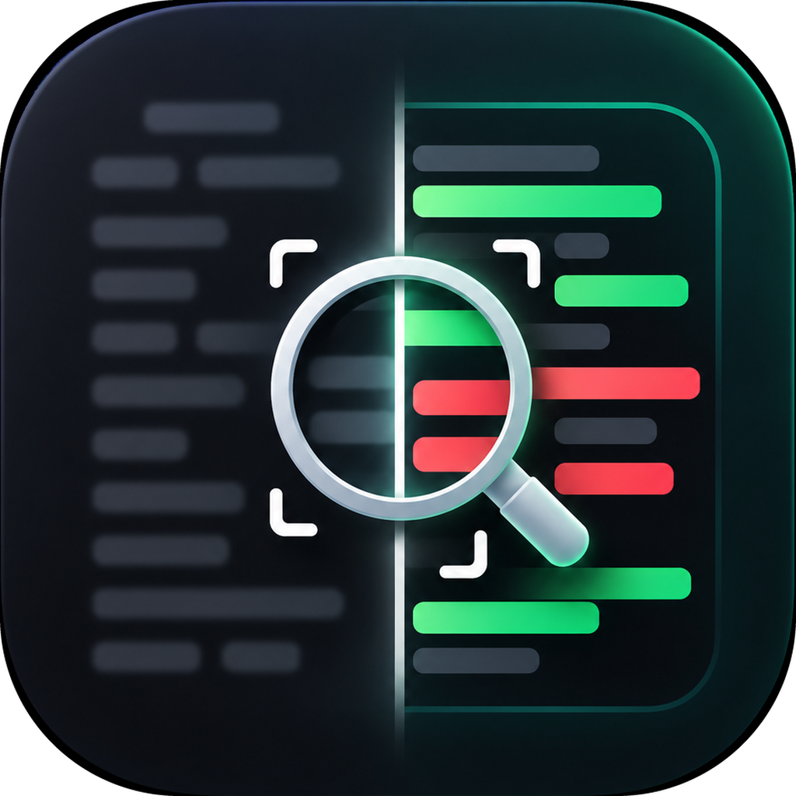
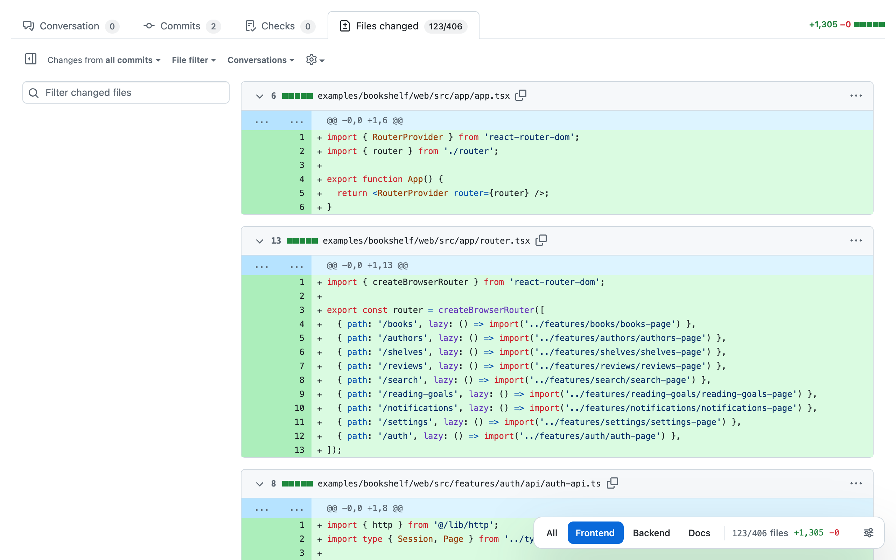

<div align="center">
  
  <h1>Focus Diff</h1>
  <p><strong>Review what matters.</strong><br>Filter GitHub pull request diffs down to the files you actually need to review.</p>
  <p>
    <a href="https://github.com/hyanmandian/focus-diff/actions/workflows/ci.yml"></a>
    <a href="LICENSE"></a>
    
  </p>
</div>

<picture>
  <source media="(prefers-color-scheme: dark)" srcset="store/screenshots/pull-request-dark.png">
  
</picture>

## Why

Large pull requests mix the code you need to read with tests, stories, generated files and docs. Focus Diff adds a small bar to the **Files changed** page: pick a filter and only the matching files stay on screen. The file tree, the **Files changed** counter and the **+/−** totals follow along, so you see the real size of your review before you start.

## Features

- **Your own filters.** Each filter is a button with an *Include* regex and an optional *Exclude* regex, tested against the full file path. **All** is always there.
- **Everywhere or per repository.** Keep filters for every pull request, and add extra ones for `owner/name` or a whole `owner/*`.
- **Real numbers.** Files changed and the line totals show only what the filter keeps, and update as GitHub loads more files.
- **Keyboard friendly.** Arrow keys inside the bar, plus global shortcuts.
- **Made to share.** Copy your filters and send them to a teammate, who imports them in one step.
- **Feels like GitHub.** Follows your GitHub theme, checked against WCAG 2.1 AA, respects reduced motion, and speaks English and Portuguese.
- **Private.** No tracking and no network requests. Filters stay in your browser profile. See the [privacy policy](PRIVACY.md).

## Example filters

These come preinstalled, and you can change them anytime in the settings.

| Filter | Include | Exclude |
|---|---|---|
| Frontend | `\.(ts\|tsx\|js\|jsx)$` | `\.(test\|spec\|stories)\.` |
| Backend | `\.py$` | `(^\|/)tests/` |
| Docs | `\.mdx?$` | |

## Keyboard shortcuts

| Shortcut | Action |
|---|---|
| <kbd>Alt</kbd> <kbd>Shift</kbd> <kbd>.</kbd> | Next filter |
| <kbd>Alt</kbd> <kbd>Shift</kbd> <kbd>,</kbd> | Previous filter |
| <kbd>Alt</kbd> <kbd>Shift</kbd> <kbd>0</kbd> | Show all files |

On a Mac, <kbd>Alt</kbd> is <kbd>Option</kbd>. Change them at `chrome://extensions/shortcuts`, or in Firefox under `about:addons` → gear → *Manage Extension Shortcuts*.

## Install

Store listings are on the way. Until then, load it from source:

- **Chrome or Edge:** open `chrome://extensions` (or `edge://extensions`), turn on **Developer mode**, click **Load unpacked** and pick the `src` folder.
- **Firefox:** run `npm run build`, open `about:debugging#/runtime/this-firefox`, click **Load Temporary Add-on** and pick `dist/firefox/manifest.json`.

## Development

```sh
npm install
npm test        # unit tests and end-to-end tests in headless Chrome, with axe accessibility checks
npm run lint    # syntax check, build and Firefox's add-on linter
npm run build   # zips for Chrome/Edge and Firefox in dist/
```

The end-to-end tests run the real content scripts on a local copy of a pull request page, so they don't depend on github.com.

## License

[MIT](LICENSE) © Hyan Mandian
